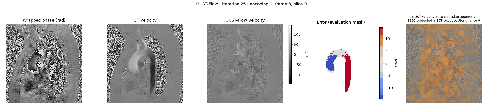

# GUST-Flow

Gaussian-based unsupervised phase unwrapping for 4D Flow MRI.

## Installation

```bash
git clone https://github.com/AssociatedPrimeIdeal/GUST-Flow.git
cd GUST-Flow
pip install .
```

A CUDA-enabled PyTorch installation and a compatible NVIDIA CUDA toolkit are
required. The Python package is `gustflow`.

## Reproducible Demo

Run [`test.ipynb`](test.ipynb) from the repository root. It loads
`TestData.h5`, reconstructs velocity using `GUSTFlow`, and exports a training GIF.



`TestData.h5` is a demonstration dataset derived from
[FlowVN](https://codeocean.com/capsule/0115983/tree/v1), cropped along the temporal
dimension to remain below 100 MB.

## License

See [LICENSE](LICENSE).
